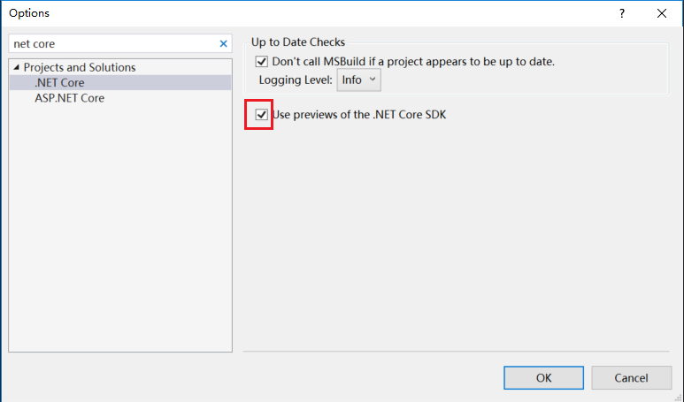

# .netCore-WPF_Designer
Workaround to use the designer in WPF Core App (.netCore WPF).

[CoreHiWPF](https://github.com/yanglr/.netCore-WPF_Designer/tree/master/CoreHiWPF): An executable WPF Core application project, need to open with Visual Studio 2019.


## Workaround to use the designer in WPF Core App


**Reference:**

[dotnet/samples - WPF Hello World sample with linked files](https://github.com/dotnet/samples/tree/master/wpf/HelloWorld-WithLinkedFiles)


## Install vs 2019 Professional/Enterprise version

Firstly, you need to Install vs 2019 Professional/Enterprise version. Then installing .net core 3.0 SDK is needed. Now you can try to create a .net core WPF application,

[](https://github.com/yanglr/.netCore-WPF_Designer/blob/master/screenShots/1555775855179.png)

After setting the relevant project name and storage path, it will pop up:

[](https://github.com/yanglr/.netCore-WinForms_Designer/raw/master/screenShots/p2.jpg)

## Check "Use preview SDK" under .NET core in VS options





After setting done, restart vs to take effect.


## Use VS build-in template, create WPF Project named "CoreHiWPF" of .net core


[](https://github.com/yanglr/.netCore-WPF_Designer/blob/master/screenShots/1555775855179.png)

[](https://github.com/yanglr/.netCore-WPF_Designer/blob/master/screenShots/1555775915106.png)

## Under the created solution, use VS build-in template to create new WPF project "HiWPF" of .net framework type


[](https://github.com/yanglr/.netCore-WPF_Designer/blob/master/screenShots/1555775957478.png)

[](https://github.com/yanglr/.netCore-WPF_Designer/blob/master/screenShots/1555775984667.png)

 


Now the file structure of the solution is below:

[](https://github.com/yanglr/.netCore-WPF_Designer/blob/master/screenShots/1555776045894.png)

## Update Assembly Name of .net core WPF "CoreHiWPF", make Assembly Names of two projects are the same

Right click the project `CoreHiWPF`, select `Properties`, then change its `Assembly Name` to `HiWPF`.

[](https://github.com/yanglr/.netCore-WPF_Designer/blob/master/screenShots/1555773128801.png)

Then right click the project, click "Edit CoreHiWPF.csproj".

[](https://github.com/yanglr/.netCore-WPF_Designer/blob/master/screenShots/1555773253120.png)

Add code as below:

[](https://github.com/yanglr/.netCore-WPF_Designer/blob/master/screenShots/1555773381960.png)

```
  <ItemGroup>
    <ApplicationDefinition Include="..\HiWPF\App.xaml" Link="App.xaml">
      <Generator>MSBuild:Compile</Generator>
    </ApplicationDefinition>
    <Compile Include="..\HiWPF\App.xaml.cs" Link="App.xaml.cs" />
  </ItemGroup>

  <ItemGroup>
    <Page Include="..\HiWPF\MainWindow.xaml" Link="MainWindow.xaml">
      <Generator>MSBuild:Compile</Generator>
    </Page>
    <Compile Include="..\HiWPF\MainWindow.xaml.cs" Link="MainWindow.xaml.cs" />
  </ItemGroup>
```

## Ensure .net core WPF project CoreHiWPF is set as start up project

If the .net core WPF project `CoreHiWPF` is already highlighted, you can ignore then. Or, you need to select project `CoreHiWPF`, then right click `Set As Start up project`.

## Try XAML Designer

Now close all opened files. Click the file `MainWindow.xaml` of project `HiWPF`. Then you can see empty WPF window in XAML designer now.

[](https://github.com/yanglr/.netCore-WPF_Designer/blob/master/screenShots/1555773860860.png)

## Modify the file MainWindow.xaml and related .cs if needed
Then, I add two lines to `Grid` of the file `MainWindow.xaml`:
- One line is a `Label` which support Wrap
- The other line is a `Exit` button.

Then I added the `Click` event to `Exit` button, added the `Loaded` event to `Window`.

[](https://github.com/yanglr/.netCore-WPF_Designer/blob/master/screenShots/modify.gif)

After finish updating code, press `F5` to run, the final UI is below:

[](https://github.com/yanglr/.netCore-WPF_Designer/blob/master/screenShots/1555774408266.png)

The code is pushed to github:

[.netCore-WPF_Designer](https://github.com/yanglr/.netCore-WPF_Designer) .


**Reference：**

[dotnet/samples - WPF Hello World sample with linked files](https://github.com/dotnet/samples/tree/master/wpf/HelloWorld-WithLinkedFiles)

[ReadMe in Chinese (中文)](https://github.com/yanglr/.netCore-WPF_Designer/blob/master/ReadMe.zh-Hans.md)
