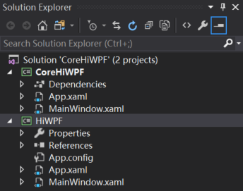
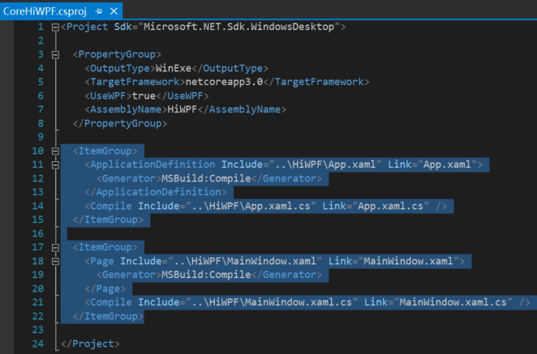

## 解决 VS2019 中.net core WPF 暂时无法使用 Designer 的临时方法

<br>
以下方法来自于微软github开源项目WPF:

[dotnet/samples - WPF Hello World sample with linked files](https://github.com/dotnet/samples/tree/master/wpf/HelloWorld-WithLinkedFiles)


## 安装 vs 2019 professional/enterprise版本

先安装 vs 2019 professional/enterprise版本，安装好.net core 3.0 SDK，此时试着创建一个.net core下的 WPF应用，


设置好相关项目名和存放路径后，会弹出:


## 在vs的设置里，勾选.NET core下的"Use preview SDK"


设置完，重启vs才能生效。

## 使用vs自带的模板，选择其中的 .net core WPF 创建Project, 取名为"CoreHiWPF"


## 在刚创建的Solution中使用vs自带的模板，选择其中的.net framework WPF添加新的project，取名为"HiWPF"


此时Solution中的文件目录为:




## 更改 .net core WPF项目 CoreHiWPF 的Assembly Name，使得两个项目一致

右键点击 .net core WPF项目 CoreHiWPF，选择最后的Properties, 然后将其Assembly Name 改为`HiWPF`.


接着右键该项目，选"Edit CoreHiWPF.csproj"。


按下图加入如下相应代码:




```xml
  <ItemGroup>
    <ApplicationDefinition Include="..\HiWPF\App.xaml" Link="App.xaml">
      <Generator>MSBuild:Compile</Generator>
    </ApplicationDefinition>
    <Compile Include="..\HiWPF\App.xaml.cs" Link="App.xaml.cs" />
  </ItemGroup>

  <ItemGroup>
    <Page Include="..\HiWPF\MainWindow.xaml" Link="MainWindow.xaml">
      <Generator>MSBuild:Compile</Generator>
    </Page>
    <Compile Include="..\HiWPF\MainWindow.xaml.cs" Link="MainWindow.xaml.cs" />
  </ItemGroup>
```


## 确保 .net core WPF项目 CoreHiWPF 是启动项目

如果.net core WPF项目 CoreHiWPF 已经高亮，就不用管了。否则，需要选中项目 CoreHiWPF ，右击后选“Set As Start up project”.


## 试用 XAML Designer

此时关闭所有打开的文件，双击项目``HiWPF`中的`MainWindow.xaml`，就可以在XAML Designer中看到空白的WPF window了。


## 按需修改MainWindow.xaml和相应的.cs

接下来，我在`MainWindow.xaml`的`Grid`中加入了两行，一行放的是一个含有文本可换行的`Label`，另一行是`Exit`按钮。然后在Exit按钮上加入了`Click`事件，在`Window`上加入了`Loaded`事件。


代码改完之后，`F5`运行，最后的界面如下:


项目代码已推到`github`，欢迎`Fork`和`star`.
传送门: [.netCore-WPF_Designer](https://github.com/yanglr/.netCore-WPF_Designer) , 如果觉得自己配置起来麻烦，也可以 clone 下来自己体验一把喔~

<br>

查看本人**最近其他原创作品**请移步：
* [解决vs2019中暂时无法为.net core WinForms使用 Designer 的临时方法](https://www.cnblogs.com/enjoy233/p/workaround_to_use_the_designer_in_winForms_Core_App.html)

* [ASP.NET Core开发者成长路线图](https://www.cnblogs.com/enjoy233/p/AspNetCore_developer_roadmap.html)

* [中国.NET：各地微软技术俱乐部汇总(持续更新中...)](https://www.cnblogs.com/enjoy233/p/China_dotNetClub_list.html)

* [微软XAML Studio - WPF, Sliverlight, Xamarin, UWP等技术开发者的福音](https://www.cnblogs.com/enjoy233/p/10569205.html)

* [微软正式发布Chromium Edge开发预览版](https://www.cnblogs.com/enjoy233/p/microsoft_release_chromium_edge_dev.html)

* [一大波开发者福利来了，一份微软官方Github上发布的开源项目清单等你签收](https://www.cnblogs.com/enjoy233/p/developer-benefits_github-open-source-projects-of-microsoft.html)

* [从0到1：使用Caliburn.Micro(WPF和MVVM)开发简单的计算器](https://www.cnblogs.com/enjoy233/p/10586651.html)

* [JS实现页面复制文字时自动加版权](https://www.cnblogs.com/enjoy233/p/10480918.html)

* [开发小白也毫无压力的hexo静态博客建站全攻略 - 躺坑后亲诉心路历程](https://www.cnblogs.com/enjoy233/p/10468996.html)

* [改进博客园Markdown显示功能(加代码行号、显示代码所用编程语言)](https://www.cnblogs.com/enjoy233/p/10410089.html)

* [当今最全面可用的微博分享组件嵌入方法(亲测2019年2月仍有效)](https://www.cnblogs.com/enjoy233/p/10349500.html)

* [前端小白也能快速学会的博客园博客美化全攻略 - 附源码](https://www.cnblogs.com/enjoy233/p/10328361.html)

* [史上最最靠谱，又双叒叒简单的基于MSXML的XML解析指南-C++](https://www.cnblogs.com/enjoy233/p/10298236.html)

<br>


**参考资料：**

[dotnet/samples - WPF Hello World sample with linked files](https://github.com/dotnet/samples/tree/master/wpf/HelloWorld-WithLinkedFiles)
